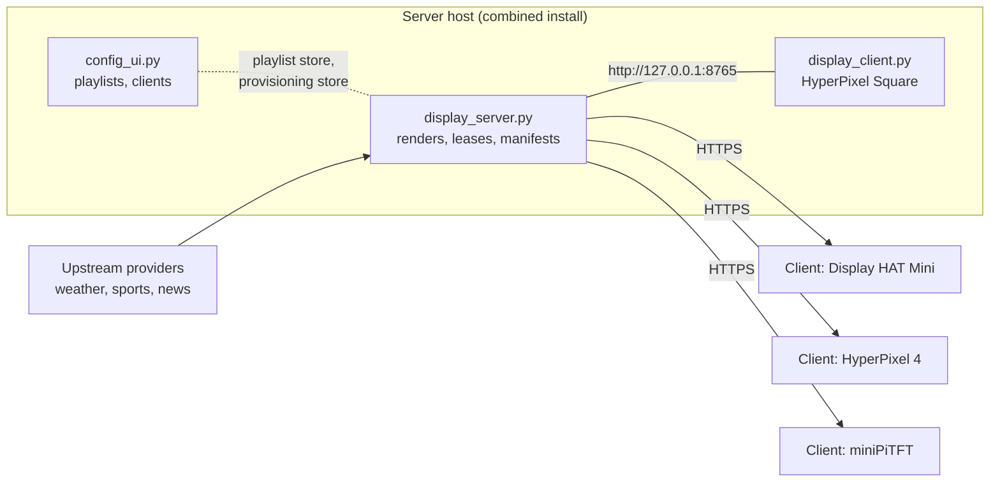
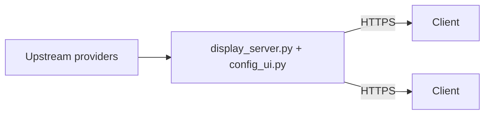
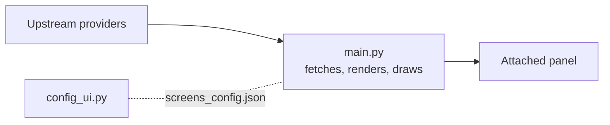

# Remote display protocol

This is the wire contract between the render server (`display_server.py`) and
display clients (`display_client.py`, with `remote_display/client_sync.py`).
For installing and running either side see [OPERATIONS.md](../OPERATIONS.md);
for what a render package contains see [render-packages.md](render-packages.md).
Version rules are in [COMPATIBILITY.md](../COMPATIBILITY.md).

## Topologies

A server with its own HyperPixel Square panel and three remote clients. The
local panel is an ordinary client on the loopback address:



A headless server (no panel) serving remote clients only:



Legacy standalone operation (v0.1 behavior, no network protocol):



## Conventions

- Every endpoint is under `/api/v1`. Request bodies are JSON objects
  (`application/json`) of at most 64 KiB; unknown top-level fields are
  rejected.
- Documents use a wire envelope, `{"type": ..., "version": N, ...fields}`.
  A receiver accepts only a known type and version with exactly that
  version's fields (`remote_display/models.py`).
- Errors are `{"error": "<code>", "message": "...", ...details}`. Validation
  errors are 400 `invalid_payload` with a `field`.
- Responses default to `Cache-Control: no-store` and
  `X-Content-Type-Options: nosniff`.

## Authentication

| Credential | Sent as | Used for |
| --- | --- | --- |
| Enrollment credential: the client's provisioned `ddc_...` secret (default), or the shared `DESK_DISPLAY_SERVER_AUTH_TOKEN` with `DESK_DISPLAY_SERVER_ENROLLMENT=shared` | `Authorization: Bearer` on `POST /register` | Proving which client is registering |
| Lease credential: issued by each registration, stored at `<cache>/client_credential` (mode 600) | `Authorization: Bearer` on every client endpoint | One lease |
| Admin token: `DESK_DISPLAY_SERVER_ADMIN_TOKEN` (32 or more characters) | `Authorization: Bearer` on `/admin/...` | Operators and the config UI |

The server stores only SHA-256 hashes of provisioned and lease credentials
and compares them in constant time. A provisioned credential is shown once,
in the response that issues it, and never again.

Any 401 from a client endpoint makes the client drop its lease credential,
register again and retry once.

## Endpoints

| Method and path | Auth | Purpose |
| --- | --- | --- |
| `GET /api/v1/health` | none | `{"status": "ok"}` |
| `POST /api/v1/register` | enrollment | Negotiate versions, start or renew a lease |
| `POST /api/v1/clients/<id>/heartbeat` | lease | Report status, extend the lease |
| `GET /api/v1/clients/<id>/config` | lease | Assigned playlist document and lease settings |
| `GET /api/v1/clients/<id>/manifest` | lease | The artifacts this client should hold |
| `GET /api/v1/clients/<id>/artifacts/<sha256>.<ext>` | lease | One artifact or render package |
| `GET /api/v1/admin/status` | admin | Clients, leases, demand, artifact store |
| `GET /api/v1/admin/render-status` | admin | Render coordinator state |
| `PUT`/`DELETE /api/v1/admin/prerender/<name>` | admin | Pre-render a screen set for a profile |
| `GET`/`POST /api/v1/admin/clients` | admin | List or provision clients |
| `POST /api/v1/admin/clients/<id>/rotate\|revoke\|disable\|enable` | admin | Manage one client's credential |

### Register

Request:

```json
{
  "capabilities": {"type": "client_capabilities", "version": 1, "...": "..."},
  "demand": {"type": "client_demand", "version": 1, "...": "..."},
  "client_credential": "<current lease credential, when renewing>"
}
```

`capabilities` is required. Its fields are `protocol_version`,
`client_software_version`, `client_id`, `display_profile`, `logical_width`,
`logical_height` (which must equal the profile's canonical size),
`image_formats`, `color_modes` and `render_package_versions`, plus optional
`supports_animation`, `has_touch`, `buttons` and
`hardware {model, panel, driver}`. `demand` is sent once the client has a
cached playlist.

The server checks, in order: the auth-failure lockout and register rate limit
for the caller's address, the protocol version, the capabilities, and then
the credential. Response 201 (new lease) or 200 (renewal):

| Field | Meaning |
| --- | --- |
| `accepted`, `protocol_version`, `server_software_version` | Negotiated versions |
| `manifest_schema_version`, `render_package_schema_version`, `playlist_schema_version`, `server_config_schema_version`, `client_config_schema_version` | Current schemas |
| `accepted_protocol_versions`, `accepted_render_package_versions` | What the server accepts |
| `client_id`, `static_client`, `renewed` | Identity |
| `assignment_state` (`assigned`/`unassigned`), `assigned_playlist` (`{playlist_id, playlist_revision}` or null) | Playlist assignment |
| `manifest_revision` | Current manifest ETag |
| `lease_seconds`, `lease_expires_at`, `heartbeat_interval_seconds`, `sync_interval_seconds` | Lease |
| `client_credential` | The new lease credential |

The current client keeps only `client_credential` from this response. It
does not use `heartbeat_interval_seconds` or `sync_interval_seconds`; see
[Heartbeat](#heartbeat).

Refusals:

| Status and code | When |
| --- | --- |
| 409 `incompatible_protocol_version` | The client's protocol version is not accepted. The body carries `client_protocol_version`, `accepted_protocol_versions` and `server_software_version`. Checked before authentication. |
| 409 `unsupported_capabilities` | No shared render-package version, or an unsupported capability |
| 401 `unauthorized` | Wrong enrollment credential |
| 403 `client_disabled` | The client is disabled |
| 409 `client_id_in_use` | Another holder has an active lease on this ID; `retry_after_seconds` says when to retry |
| 409 `static_profile_mismatch` | A static client registered with a profile other than its configured one |
| 429 `rate_limited` | See [Rate limits](#rate-limits) |

### Leases

A lease lasts `DESK_DISPLAY_CLIENT_LEASE_SECONDS` (default 300, at least 30).
Each heartbeat extends it by that much. A lease ends when:

- its deadline passes (checked before every request);
- an operator rotates or revokes the client's credential, or disables it; or
- the client registers under a newer provisioned credential.

An ended lease loses its credential and demand. The client re-registers on
its next sync, and keeps playing from its cache in the meantime.

### Heartbeat

`POST /api/v1/clients/<id>/heartbeat` with `{"status": {...}, "demand": {...}}`
(`demand` optional). `status` is a `client_status` document:

- `client_id`;
- `playback_state`: `starting`, `playing`, `focus`, `paused`, `dark`,
  `offline` or `error` (the current client sends only `starting`,
  `playing`, `offline` and `error`);
- `accepted_revisions {manifest_revision, playlist_revision, config_revision}`;
- `current_screen` and `current_playlist`;
- `last_sync_age_seconds` and `cache_age_seconds`;
- `physical_rotation`, for diagnosis only;
- `recent_errors`: up to 10 entries of
  `{code, message, count, last_seen_age_seconds}` (the client keeps at
  most 8).

The response repeats the assignment, `manifest_revision` and lease fields.
The client sends one heartbeat per sync pass, every
`DESK_DISPLAY_SYNC_INTERVAL_SECONDS` (default 30). It ignores the
`heartbeat_interval_seconds` and `sync_interval_seconds` the server
advertises (in the register, heartbeat and config responses and the
manifest's `configuration`), and `DESK_DISPLAY_HEARTBEAT_INTERVAL_SECONDS`
is not used. Keep the sync interval well under half the lease: the Clients
page marks a client stale after 1.5 advertised heartbeat intervals.

### Config

`GET /api/v1/clients/<id>/config` returns `client_config_schema_version`,
`client_id`, `display_profile`, the assignment and lease fields, and
`playlist`: `{playlist_id, playlist_revision, playlist_schema_version,
document}` or null. The response passes through secret scrubbing.

### Manifest

`GET /api/v1/clients/<id>/manifest` with
`If-None-Match: "<manifest_revision>"` answers 304 when nothing changed. Its
ETag is `manifest_revision`, which is `m-` followed by 20 hex digits of the
SHA-256 of the canonical manifest (without `generated_at`).

| Field | Meaning |
| --- | --- |
| `type` | `client_manifest` |
| `client_id`, `display_profile`, `logical_width`, `logical_height`, `color_mode` | Who and what size |
| `assignment_state`, `assigned_playlist` | As in register |
| `configuration` | `{lease_seconds, heartbeat_interval_seconds, sync_interval_seconds}` |
| `requested_screens`, `interactive_dependency_screens` | Screens the playlist needs, and quad tiles a tap can open |
| `artifacts` | One entry per screen (below) |
| `missing_screens` | Screens with no usable artifact yet |
| `cache_complete` | True when every requested screen has an artifact |
| `state`, `refresh_deadline` | `fresh`, `stale` or `incomplete`, and when to look again |
| Version fields | As in register |
| `manifest_revision`, `generated_at` | Identity |

Each artifact entry has:

- `screen_id`, `role` (`requested` or `interactive_dependency`) and
  `artifact_type`;
- `url`, `sha256`, `length` and `media_type`;
- `width`, `height` and `color_mode`;
- `render_key_digest`, `generated_at` and `refresh_deadline`;
- `state` (`fresh`, `stale` or `fallback`), `stale`, and `failure`
  (`{code, message, at, consecutive}`) when the last render failed;
- `animation`, `required_capabilities` and `remote_class`;
- `package`: `{url, sha256, length, media_type, kind, classification,
  render_package_schema_version}`, for screens that ship a render package.

A screen whose render failed with nothing to fall back to appears as a stub,
`{screen_id, role, state, stale: true, failure}`.

### Artifacts

`GET /api/v1/clients/<id>/artifacts/<sha256>.<ext>` serves `png` images and
`json` render packages
(`application/vnd.desk-display.render-package+json`). The server answers 404
unless that client's manifest references the hash. Responses support
`Range`/`If-Range`, use the hash as ETag, and are cacheable forever
(`private, max-age=31536000, immutable`).

The client downloads only relative URLs under its own
`/api/v1/clients/<id>/artifacts/`, at most 16 MiB and never more than the
declared `length`. Before it uses anything it checks:

- **Images:** type `static_image`, a supported media type, the exact length
  and SHA-256, the manifest's width, height and colour mode, a PNG that
  decodes to at most 64 MiB, and a clean Pillow verify and load.
- **Packages:** the length, SHA-256, the package validator, and a matching
  screen and profile.

It fetches packages only when it supports animation, or for clock packages.
It re-hashes cached files on read and drops corrupt ones.

A client may play offline from its cache only when that cache holds a
manifest with `cache_complete: true` and schema versions it still supports.

## Rate limits

With `DESK_DISPLAY_SERVER_RATE_LIMITS=1` (the default) the server applies
token buckets:

| Bucket | Burst | Refill | Keyed by |
| --- | --- | --- | --- |
| `register` | 20 | 1 per 3 s | remote address |
| `auth_failure` | 20 | 1 per 3 s | remote address; an empty bucket locks out register, client and admin requests |
| `heartbeat` | 30 | 1 per s | client ID |
| `manifest` (config and manifest) | 60 | 2 per s | client ID |
| `artifact` | 600 | 50 per s | client ID |

A limited request gets 429
`{"error": "rate_limited", "retry_after_seconds": N}` and `Retry-After: N`.
The client waits the larger of `retry_after_seconds` and its own backoff
(a random wait between half and all of a limit that starts at 2 s and
doubles after each failure, up to 300 s). It reads `retry_after_seconds`
from the JSON body of any error (including 409 `client_id_in_use`), not the
`Retry-After` header, so a 429 from a proxy that sends only the header gets
the ordinary backoff.

## Admin client management

| Request | Response |
| --- | --- |
| `POST /api/v1/admin/clients` with `{client_id, display_profile, playlist_id?}` | 201 `{client_id, display_profile, client_credential, client_env, warnings, note}`. The only time the credential is shown. |
| `POST .../<id>/rotate` | 200 with a new credential and `client_env`; ends the lease. Re-activates a revoked client. |
| `POST .../<id>/revoke` | `{client_id, state: "revoked"}`; ends the lease |
| `POST .../<id>/disable`, `.../enable` | `{client_id, disabled}` |
| `GET /api/v1/admin/clients` | `{enrollment, clients}`, never with credentials or hashes |

`python3 -m remote_display.provisioning provision|rotate|revoke|disable|enable|list`
does the same from the server's shell.

## Transport security

The server serves TLS itself when `DESK_DISPLAY_SERVER_TLS_CERT` and
`DESK_DISPLAY_SERVER_TLS_KEY` are both set, and plain HTTP otherwise (put it
behind a TLS reverse proxy). It binds `127.0.0.1:8765` by default and warns
at startup when it listens beyond loopback without TLS.

A client verifies certificates (`DESK_DISPLAY_TLS_VERIFY=1`), optionally
against `DESK_DISPLAY_SERVER_CA_BUNDLE`. It follows no redirects and times
out after 15 s. Plain `http://` to a non-loopback server, or disabled
verification, is a startup error unless
`DESK_DISPLAY_ALLOW_INSECURE_TRANSPORT=1` makes it a warning.

## Versions

| Constant (`protocol_versions.py`) | Value |
| --- | --- |
| `APPLICATION_VERSION` | `0.1` |
| `NETWORK_PROTOCOL_VERSION` | 1 |
| `MANIFEST_SCHEMA_VERSION` | 1 |
| `RENDER_PACKAGE_SCHEMA_VERSION` | 1 |
| `PLAYLIST_SCHEMA_VERSION` | 2 |
| `SERVER_CONFIG_SCHEMA_VERSION` | 1 |
| `CLIENT_CONFIG_SCHEMA_VERSION` | 1 |

The server accepts exactly the current protocol and render-package versions.
[COMPATIBILITY.md](../COMPATIBILITY.md) says how versions are bumped.
